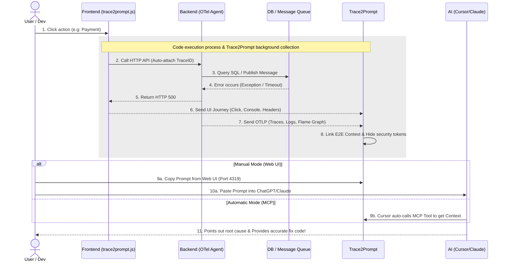
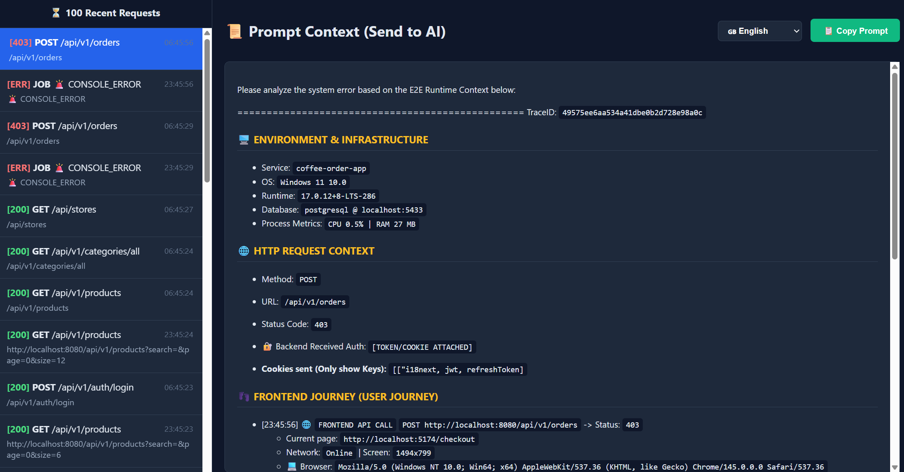

<div align="center">
  
  # 🚀 Trace2Prompt
  **"Zero-Config" AI Debug Assistant - Automatically Collects Runtime Context & Distributed Logs**
  
  [](https://goreportcard.com/report/github.com/yourusername/trace2prompt)
  [](https://opensource.org/licenses/MIT)
</div>

## 😩 The Pain: "Hey AI, why did my app crash?"

_Read this in other languages: [🇻🇳 Tiếng Việt](README.vi.md)._

You open ChatGPT/Claude and type:

> _"Hey AI, I clicked button A, then filled out form B, and suddenly the project stopped working. Why is there a business logic error here? Why is the system so slow?"_

And the result? AI gives generic, cliché answers, or worse, **makes up incorrect code**. The simple reason is that **AI is blind to the Runtime Environment (Context at execution time)**. It only knows how to read static code, but doesn't know what the actual data was at that time.

Furthermore, in modern systems, **logs are often scattered everywhere**: Frontend reports errors in the browser console, Backend throws exceptions in the terminal, SQL gets stuck in the database.
To help AI understand, you have to manually piece together from 3-4 different places. This process of collecting scattered logs is extremely time-consuming and makes developers "lazy" about using AI to debug complex errors!

## 💡 Solution: Trace2Prompt

**Trace2Prompt** is an extremely lightweight background daemon that acts as a data collection station for the OpenTelemetry (OTLP) standard.

Instead of lazily collecting logs manually, with just **1 click**, Trace2Prompt will automatically summarize the entire **Runtime Context (End-to-end Journey)**:

- 🖱️ User behavior (What they clicked, which API they called on Frontend)
- 🌐 HTTP Status & Headers (automatically hides security tokens)
- ⚙️ Backend execution Flame Graph (Which class, which line of code has the error)
- 🗄️ Actual SQL commands that were executed
- 🐰 Background Async flows (RabbitMQ/Kafka) if any

...and packages all those scattered logs into a **100% standard Prompt**, ready to throw at AI to diagnose accurately down to each line of code!

## 🗺️ Workflow Diagram



## ✨ Key Features

- **⚡ Zero-Config (No code changes needed):** Just attach the agent to your regular app startup command and you can start monitoring.
- **🪶 Ultra-lightweight & Optimized (Low Footprint):** Written in Golang, the background daemon runs extremely smoothly, using almost no CPU and **only consuming a few dozen MB of RAM**. Won't slow down your machine!
- **🚀 10x Debug Performance with AI:**
  - **E2E Log Aggregation:** No more arguing about whether the error is from Frontend or Backend. The tool combines Frontend Console/Clicks + Backend APIs + Background System Errors into a single flow.
  - **Deep Database Insights:** Provides detailed Flame Graph execution order and extracts original SQL commands. AI can immediately spot N+1 Query or Deadlock errors.
- **🛡️ Privacy-First Security:** Sensitive information like Passwords, JWT Tokens, Emails are automatically redacted to `[REDACTED]` before being sent to AI.
- **🤖 AI Agent Integration (MCP):** Supports MCP protocol allowing AI IDEs (like Cursor) to automatically extract context without Copy-Paste.

## 🎯 Example Output (Actual Prompt sent to AI)



Trace2Prompt will generate a perfect structure like this (just Copy & Paste):

```text
Please analyze the system error based on the E2E Runtime Context below:

=================================================
TraceID: `6464d81b63cbc1de7184d0c90ce53891`

### 🖥️ ENVIRONMENT & INFRASTRUCTURE
- Service: `coffee-order-app`
- OS: `Windows 11 10.0`
- Runtime: `17.0.12+8-LTS-286`
- Database: `redis @ localhost:8080`
- 📊 CPU Usage (At request time): `0.02%`
- 🧠 JVM Memory Used: `18 MB`

### 🌐 HTTP REQUEST CONTEXT
- Method: `GET`
- URL: `/api/v1/products?search=&page=0&size=6`
- Status Code: `200`
- 🔐 Backend Received Auth: `[TOKEN/COOKIE ATTACHED]`

- 🍪 **Attached Cookies (Keys only):** `[["jwt, refreshToken, i18next"]`

### 👣 FRONTEND JOURNEY (USER JOURNEY)
- [22:27:49] 🖱️ `CLICK` at `http://localhost:5174/` (Element: `[Menu] A.px-3.py-2.rounded-md.text-sm.font-medium.transition-colors.duration-200.text-amber-200.hover:text-amber-50.hover:bg-amber-800/50.`)
- [22:27:30] 🌐 `FRONTEND API CALL` `GET http://localhost:8080/api/v1/products?search=&page=0&size=6` -> Status: `200`
  - 📍 Current Page: `http://localhost:5174/`
  - 📶 Network: `Online` | 🖥️ Screen: `1134x799`
  - 💻 Browser: `Mozilla/5.0 (Windows NT 10.0; Win64; x64) AppleWebKit/537.36 (KHTML, like Gecko) Chrome/145.0.0.0 Safari/537.36`
  - 🎫 Headers: `{"Accept":"application/json, text/plain, */*"}`
  - 🔺 Response Body:
    {
  "content": [
    {
      "id": 1,
      "name": "Espresso",
      "description": "Rich and pure espresso shot",
      "imageUrl": "/Espresso.png",
      "category": {
        "id": 2,
        "name": "Espresso"
      },
      "variants": [
        {
          "id": 1,
          "sku": "S-29000",
          "size": "S",
          "price": 29000,
          "stockQuantity": null,
          "isActive": true
        },
        {
          "id": 2,
          "sku": "M-35000",
          "size": "M",
          "price": 35000,
          "stockQuantity": null,
          "isActive": true
        },
        {
          "id": 3,
          "sku": "L-39000",
          "size": "L",
          "price": 39000,
          "stockQuantity": null,
          "isActive": true
        }
      ],
      "isActive": true
    },
    {
      "id": 2,
      "name": "Cappuccino",
      "description": "Espresso topped with foamy milk",
      "imageUrl": "/Cappuccino.png",
      "category": {
        "id": 5,
        "name": "Cappuccino"
      },
      "variants": [
        {
          "id": 4,
          "sku": "S-35000",
          "size": "S",
          "price": 35000,
          "stockQuantity": null,
          "isActive": true
        },
        {
          "id": 5,
          "sku": "M-42000",
          "size": "M",
          "price": 42000,
          "stockQuantity": null,
          "isActive": true
        },
        {
          "id": 6,
          "sku": "L-48000",
          "size": "L",
          "price


    ... [TRUNCATED DUE TO LENGTH]
- [22:27:30] 🖱️ `CLICK` at `http://localhost:5174/checkout` (Element: `[The Coffee Corner] SPAN.text-xl.font-bold.text-amber-50`)
- [22:24:11] 🖱️ `CLICK` at `http://localhost:5174/checkout` (Element: `[PLACE ORDER & PAYMENT] BUTTON.w-full.bg-amber-600.text-white.py-3.5.rounded-lg.font-bold.text-lg.shadow-lg.hover:bg-amber-700.hover:shadow-xl.transition-all.disabled:opacity-50.disabled:cursor-not-allowed`)

### 🛤️ BACKEND JOURNEY (LOGS)
- [INFO] [CustomUserDetailsService] User [EMAIL_HIDDEN] has authorities: [ROLE_STAFF]
- [INFO] [ProductController] Calling getAllProducts with search: , page: 0, size: 6

### 🛑 BACKEND EXCEPTION STACKTRACE
- (Backend did not throw Exception)

### ⏳ EXECUTION ORDER & SQL (FLAME GRAPH)
- [35 ms] ⚙️ `GET /api/v1/products`
  - [9 ms] ⚙️ `UserRepository.findByEmail`
    - [8 ms] ⚙️ `SELECT com.coffeeshop.backend.entity.User`
      - [3 ms] 🗄️ [DB] `testdb`
      - [1 ms] 🗄️ [DB] `SELECT testdb.users`
        - Query: `select u1_0.id,u1_0.created_at,u1_0.email,u1_0.fullname,u1_0.password,u1_0.phone,u1_0.role,u1_0.store_id,u1_0.updated_at
        FROM users u1_0
        WHERE u1_0.email=?`
  - [3 ms] ⚡ [REDIS] `GET`
    - Redis Command: `GET products::SimpleKey [, Page request [number: 0, size 6, sort: UNSORTED]]`
=================================================


```

## 🚀 Quick Start (Just 2 minutes)

### Step 1: Start Trace2Prompt

You can run Trace2Prompt in one of 3 ways:

**Method 1: Download pre-built binary (Fastest)**
Download the binary file corresponding to your OS from the [Releases](https://github.com/thuanDaoSE/trace2prompt/releases/latest) page and double-click to run.

**Method 2: Build with Docker (No Go installation needed)**
If you have Docker, you can "borrow" Docker to compile the source code into a local executable cleanly:

```bash
git clone https://github.com/thuanDaoSE/trace2prompt.git
cd trace2prompt

# For Mac/Linux:
docker run --rm -v $(pwd):/app -w /app golang:1.21 go build -o trace2prompt main.go otel_handlers.go prompt_generator.go mcp_server.go
./trace2prompt

# For Windows (PowerShell):
docker run --rm -v ${PWD}:/app -w /app golang:1.21 go build -o trace2prompt.exe main.go otel_handlers.go prompt_generator.go mcp_server.go
.\trace2prompt.exe
```

**Method 3: Build with Go (If you have Go installed)**

```bash
go build -o trace2prompt main.go otel_handlers.go prompt_generator.go mcp_server.go
./trace2prompt
```

_(Tool will start listening for logs on port `localhost:4318` and open Web UI at `http://localhost:4319`)_

### Step 2: Enable OTel for your project

> 💡 **Pro Tip:** The startup command is quite long, for daily development convenience, you should save this command to a `run.bat` file (for Windows) / `run.sh` (for Mac/Linux), or put these `-Dotel...` variable configurations directly into `launch.json` (VS Code) / Run Configuration (IntelliJ)!

Tested & works stably with OTel Agent v2.26.0.

Download OpenTelemetry Java Agent v2.26.0:

```bash
curl -L -o opentelemetry-javaagent.jar "https://github.com/open-telemetry/opentelemetry-java-instrumentation/releases/download/v2.26.0/opentelemetry-javaagent.jar"
```

Trace2Prompt uses the international OpenTelemetry (OTLP) standard, so it supports **100% of all programming languages**.

💡 **Note about System Architecture:**

- **Monolith Project:** You just need to set environment variables and attach the agent to your single Backend project.
- **Microservices Project:** Even better! You just need to repeat this agent attachment process for **all** your Backend services (remember to change the `OTEL_SERVICE_NAME` for each one). Trace2Prompt will automatically link (Distributed Tracing) cross-API calls into a complete flow!

👇 **Click on your stack below to see integration instructions:**

<details>
<summary><b>☕ Java (Spring Boot, Quarkus, etc...)</b></summary>
<br>
**🪟 For Windows (Run on 1 command line):**

```bash
java -javaagent:opentelemetry-javaagent.jar "-Dotel.service.name=my-spring-app" "-Dotel.traces.exporter=otlp" "-Dotel.logs.exporter=otlp" "-Dotel.metrics.exporter=otlp" "-Dotel.exporter.otlp.endpoint=http://localhost:4318" "-Dotel.exporter.otlp.protocol=http/protobuf" "-Dotel.instrumentation.http.capture-headers.server.request=Authorization,Cookie,Accept,User-Agent,Content-Type" "-Dotel.instrumentation.http.server.capture-request-headers=Authorization,Cookie,Accept,User-Agent,Content-Type" "-Dotel.bsp.schedule.delay=500" "-Dotel.blrp.schedule.delay=500" -jar your-application.jar
```

**🐧 For Mac/Linux:**
Download the `opentelemetry-javaagent.jar` file and run the following command:

```bash
java -javaagent:opentelemetry-javaagent.jar \
  -Dotel.service.name=my-spring-app \
  -Dotel.traces.exporter=otlp \
  -Dotel.logs.exporter=otlp \
  -Dotel.metrics.exporter=otlp \
  -Dotel.exporter.otlp.endpoint=http://localhost:4318 \
  -Dotel.exporter.otlp.protocol=http/protobuf \
  -Dotel.instrumentation.http.capture-headers.server.request=Authorization,Cookie,Accept,User-Agent,Content-Type \
  -Dotel.instrumentation.http.server.capture-request-headers=Authorization,Cookie,Accept,User-Agent,Content-Type \
  -Dotel.bsp.schedule.delay=500 \
  -Dotel.blrp.schedule.delay=500 \
  -jar your-application.jar
```

</details>

<details>
<summary><b>🟢 Node.js (Express, NestJS)</b></summary>
<br>

Install auto-instrumentation package:

```bash
# Install necessary libraries
npm install @opentelemetry/auto-instrumentations-node @opentelemetry/api
```

Then start the application (with Agent and Full optimal configuration):

```bash

# Run application with environment variables identical to Java
env OTEL_SERVICE_NAME="node-backend-app" \
    OTEL_TRACES_EXPORTER="otlp" \
    OTEL_LOGS_EXPORTER="otlp" \
    OTEL_METRICS_EXPORTER="otlp" \
    OTEL_EXPORTER_OTLP_ENDPOINT="http://localhost:4318" \
    OTEL_EXPORTER_OTLP_PROTOCOL="http/protobuf" \
    OTEL_INSTRUMENTATION_HTTP_CAPTURE_HEADERS_SERVER_REQUEST="Authorization,Cookie,Accept,User-Agent,Content-Type" \
    OTEL_BSP_SCHEDULE_DELAY=500 \
    OTEL_BLRP_SCHEDULE_DELAY=500 \
    node --require @opentelemetry/auto-instrumentations-node/register app.js
```

</details>

<details>
<summary><b>🐍 Python (Flask, Django, FastAPI)</b></summary>
<br>

Use OpenTelemetry's CLI toolkit to automatically install Sensors:

```bash
# Install OTel auto-instrumentation tool
pip install opentelemetry-distro opentelemetry-exporter-otlp
opentelemetry-bootstrap -a install
```

Wrap your Python run command with `opentelemetry-instrument`:

```bash

# Start application with standard configuration
env OTEL_SERVICE_NAME="python-backend-app" \
    OTEL_TRACES_EXPORTER="otlp" \
    OTEL_LOGS_EXPORTER="otlp" \
    OTEL_METRICS_EXPORTER="otlp" \
    OTEL_EXPORTER_OTLP_ENDPOINT="http://localhost:4318" \
    OTEL_EXPORTER_OTLP_PROTOCOL="http/protobuf" \
    OTEL_INSTRUMENTATION_HTTP_CAPTURE_HEADERS_SERVER_REQUEST="Authorization,Cookie,Accept,User-Agent,Content-Type" \
    OTEL_BSP_SCHEDULE_DELAY=500 \
    OTEL_BLRP_SCHEDULE_DELAY=500 \
    opentelemetry-instrument python main.py
```

</details>

<details>
<summary><b>🐹 Golang (Gin, Fiber)</b></summary>
<br>

With Go, you need to initialize OTel Provider in your `main.go` file. Refer to [Official OpenTelemetry Go Documentation](https://opentelemetry.io/docs/instrumentation/go/getting-started/). After configuration, run normally with environment variables:

```bash
# Go code will automatically follow standard OS environment variables
export OTEL_SERVICE_NAME="go-backend-app"
export OTEL_EXPORTER_OTLP_ENDPOINT="http://localhost:4318"
export OTEL_EXPORTER_OTLP_PROTOCOL="http/protobuf"
export OTEL_BSP_SCHEDULE_DELAY=500
# ... then run the executable
./my-go-app
```

</details>

<details>
<summary><b>⚛️ Frontend (React, Vue, Next.js, Vanilla JS)</b></summary>
<br>

Whether you use `axios`, `fetch`, or `React Query`... Trace2Prompt will automatically capture complete E2E Context thanks to Native interception mechanism. Just paste this Script tag into the `<head>` tag in your project's root `index.html` file:

```html
<script type="module" src="http://localhost:4319/trace2prompt.js"></script>
```

</details>

### Step 3: Experience the AI magic!

1. Interact with your app and intentionally create an error (e.g: Payment error 500).
2. Open browser to `http://localhost:4319`.
3. Click **"Copy Prompt"** on the red error trace.
4. Paste into ChatGPT/Claude and let AI read the complete E2E context and provide 100% accurate fix code!

---

## 🤖 For Autonomous AI Agents (MCP)

The project has built-in **Model Context Protocol (MCP)** server on port `4318`.
You can configure IDEs (like Cursor or Claude Desktop) to automatically call Trace2Prompt's `get_latest_error_trace` tool after test failures. At this point, AI will automatically read E2E Trace, diagnose issues, and fix code completely automatically (Autonomous Agent Workflow)!

> ⚠️ **Note:** This Agentic Workflow feature is in Beta phase, you can customize MCP to work with your workflow as desired.

---

## 🤝 Contributing

Open source lives thanks to the community. All code optimization ideas, bug reports (Issues), or Pull Requests are appreciated!

## 📄 License

This project is distributed under the MIT License.
