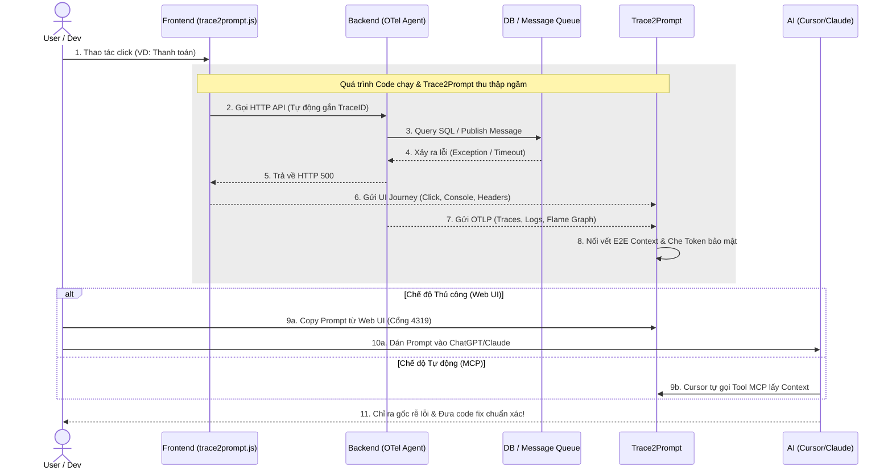

<div align="center">
  
  # 🚀 Trace2Prompt
  **Trợ lý Debug AI "Zero-Config" - Tự động gom trọn Runtime Context & Log phân tán**
  
  [](https://goreportcard.com/report/github.com/yourusername/trace2prompt)
  [](https://opensource.org/licenses/MIT)
</div>

## 😩 Nỗi đau: "AI ơi, tại sao app của tôi sập?"

Bạn mở ChatGPT/Claude lên và gõ:

> _"Ê AI, tôi bấm nút A, rồi điền form B, tự nhiên dự án không chạy, tại sao chỗ này lại lỗi nghiệp vụ? Hệ thống chậm rì là do đâu?"_

Và kết quả? AI trả lời những câu chung chung sáo rỗng, hoặc tệ hơn là **bịa ra code sai**. Lý do đơn giản là vì **AI bị mù Môi trường Runtime (Ngữ cảnh lúc chạy)**. Nó chỉ biết đọc code tĩnh, chứ không biết dữ liệu thực tế lúc đó là gì.

Hơn nữa, trong các hệ thống hiện đại, **Log thường văng tứ tung mỗi nơi một nẻo**: Frontend báo lỗi ở Console trình duyệt, Backend văng Exception ở Terminal, SQL thì kẹt ở Database.
Để AI hiểu, bạn phải lóc cóc đi chắp vá thủ công từ 3-4 nơi khác nhau. Việc đi gom nhặt đống log phân tán này cực kỳ tốn thời gian và làm anh em Dev "lười" dùng AI để debug lỗi phức tạp!

## 💡 Giải pháp: Trace2Prompt

**Trace2Prompt** là một công cụ chạy ngầm (Daemon) cực nhẹ, đóng vai trò như một trạm thu thập dữ liệu chuẩn OpenTelemetry (OTLP).

Thay vì phải lười biếng đi gom log thủ công, **chỉ với 1 click chuột**, Trace2Prompt sẽ tự động tóm gọn toàn bộ **Runtime Context (Hành trình xuyên suốt)**:

- 🖱️ Hành vi của User (Bấm vào đâu, gọi API nào trên Frontend).
- 🌐 Trạng thái HTTP & Headers (ẩn Token bảo mật tự động).
- ⚙️ Flame Graph thực thi dưới Backend (Lỗi ở class nào, dòng code nào).
- 🗄️ Các câu lệnh SQL đã được chạy thực tế.
- 🐰 Luồng chạy ngầm Async (RabbitMQ/Kafka) nếu có.

...và đóng gói tất cả đống log phân tán đó thành một **Prompt chuẩn mực 100%**, sẵn sàng để ném cho AI "bắt bệnh" chính xác tới từng dòng code!

## 🗺️ Sơ đồ hoạt động (Workflow)



## ✨ Tính năng nổi bật

- **⚡ Zero-Config (Không cần sửa code):** Cắm Agent vào lệnh chạy app thông thường là có thể bắt đầu monitor.
- **🧩 Cân mọi Microservices & Async:** Tự động nối vết (Trace) xuyên qua API Gateway, HTTP và Message Queue.
- **🛡️ Đề cao Bảo mật (Privacy First):** Các thông tin nhạy cảm như Password, JWT Token, Email, Signed URL tự động bị băm nát thành `[REDACTED]` trước khi đưa cho AI.
- **🤖 Tích hợp AI Agents:** Hỗ trợ giao thức MCP cho phép các AI IDE (như Cursor) tự động trích xuất ngữ cảnh.

---

## 🚀 Khởi chạy nhanh (Chỉ 2 phút)

### Bước 1: Khởi động Trace2Prompt

Bạn có thể chạy Trace2Prompt bằng 1 trong 3 cách sau:

**Cách 1: Tải file chạy sẵn (Nhanh nhất)**
Tải file nhị phân (Binary) tương ứng với hệ điều hành của bạn tại trang [Releases](https://github.com/yourusername/trace2prompt/releases) và click đúp để chạy.

**Cách 2: Build bằng Docker (Không cần cài Go)**
Nếu máy bạn có Docker, bạn có thể "mượn" Docker để biên dịch mã nguồn thành file chạy cục bộ một cách sạch sẽ:

```bash
git clone [https://github.com/yourusername/trace2prompt.git](https://github.com/yourusername/trace2prompt.git)
cd trace2prompt

# Với Mac/Linux:
docker run --rm -v $(pwd):/app -w /app golang:1.21 go build -o trace2prompt main.go otel_handlers.go prompt_generator.go mcp_server.go
./trace2prompt

# Với Windows (PowerShell):
docker run --rm -v ${PWD}:/app -w /app golang:1.21 go build -o trace2prompt.exe main.go otel_handlers.go prompt_generator.go mcp_server.go
.\trace2prompt.exe
```

**Cách 3: Tự Build bằng Go (Nếu máy đã cài Go)**

```bash
go build -o trace2prompt main.go otel_handlers.go prompt_generator.go mcp_server.go
./trace2prompt
```

_(Tool sẽ bắt đầu lắng nghe log ở cổng `localhost:4318` và mở giao diện Web tại `http://localhost:4319`)_

### Bước 2: Bật OTel cho dự án của bạn

Trace2Prompt sử dụng chuẩn OpenTelemetry (OTLP) quốc tế nên hỗ trợ **100% mọi ngôn ngữ lập trình**.

💡 **Lưu ý về Kiến trúc hệ thống:**

- **Dự án Monolith (Đơn khối):** Bạn chỉ cần thiết lập biến môi trường và gắn Agent vào dự án Backend duy nhất của bạn.
- **Dự án Microservices (Đa dịch vụ):** Tuyệt vời hơn nữa! Bạn chỉ cần lặp lại thao tác gắn Agent này cho **tất cả** các dịch vụ Backend của bạn (nhớ đổi tên `OTEL_SERVICE_NAME` cho từng cái). Trace2Prompt sẽ tự động nối vết (Distributed Tracing) các API gọi chéo nhau thành một luồng hoàn chỉnh!

👇 **Hãy click vào Stack của bạn bên dưới để xem hướng dẫn tích hợp:**

<details>
<summary><b>☕ Java (Spring Boot, Quarkus, v.v...)</b></summary>
<br>

**🔥 Dành cho Windows (Nhanh nhất):** Chỉ cần copy file `run-dev.bat` có sẵn trong mã nguồn dự án này, để ngang hàng với thư mục code Java của bạn và click đúp! Nó sẽ tự động tải Agent và cấu hình mọi thứ.

**🐧 Dành cho Mac/Linux:**
Tải file `opentelemetry-javaagent.jar` và chạy lệnh sau:

```bash
export OTEL_SERVICE_NAME="my-java-app"
export OTEL_TRACES_EXPORTER="otlp"
export OTEL_EXPORTER_OTLP_ENDPOINT="http://localhost:4318"
export OTEL_EXPORTER_OTLP_PROTOCOL="http/protobuf"
export OTEL_BSP_SCHEDULE_DELAY=500
export OTEL_INSTRUMENTATION_HTTP_CAPTURE_HEADERS_SERVER_REQUEST="Authorization,Cookie,Accept"

java -javaagent:path/to/opentelemetry-javaagent.jar -jar your-app.jar
```

</details>

<details>
<summary><b>🟢 Node.js (Express, NestJS)</b></summary>
<br>

Cài đặt gói tự động (auto-instrumentation):

```bash
npm install @opentelemetry/auto-instrumentations-node
```

Sau đó khởi chạy ứng dụng (kèm theo Agent và Full cấu hình tối ưu):

```bash
export OTEL_SERVICE_NAME="my-node-app"
export OTEL_TRACES_EXPORTER="otlp"
export OTEL_EXPORTER_OTLP_ENDPOINT="http://localhost:4318"
export OTEL_EXPORTER_OTLP_PROTOCOL="http/protobuf"
export OTEL_BSP_SCHEDULE_DELAY=500
export OTEL_INSTRUMENTATION_HTTP_CAPTURE_HEADERS_SERVER_REQUEST="Authorization,Cookie,Accept"

node --require @opentelemetry/auto-instrumentations-node/register app.js
```

</details>

<details>
<summary><b>🐍 Python (Flask, Django, FastAPI)</b></summary>
<br>

Sử dụng bộ công cụ CLI của OpenTelemetry để tự động cài đặt các Sensor:

```bash
pip install opentelemetry-distro opentelemetry-exporter-otlp
opentelemetry-bootstrap -a install
```

Bọc lệnh chạy Python của bạn bằng lệnh `opentelemetry-instrument`:

```bash
export OTEL_SERVICE_NAME="my-python-app"
export OTEL_TRACES_EXPORTER="otlp"
export OTEL_EXPORTER_OTLP_ENDPOINT="http://localhost:4318"
export OTEL_EXPORTER_OTLP_PROTOCOL="http/protobuf"
export OTEL_BSP_SCHEDULE_DELAY=500
export OTEL_INSTRUMENTATION_HTTP_CAPTURE_HEADERS_SERVER_REQUEST="Authorization,Cookie,Accept"

opentelemetry-instrument python app.py
```

</details>

<details>
<summary><b>🐹 Golang (Gin, Fiber)</b></summary>
<br>

Với Go, bạn cần khởi tạo OTel Provider trong file `main.go`. Tham khảo [Tài liệu chính thức của OpenTelemetry Go](https://opentelemetry.io/docs/instrumentation/go/getting-started/). Sau khi cấu hình xong, chạy bình thường với các biến môi trường:

```bash
export OTEL_SERVICE_NAME="my-go-app"
export OTEL_EXPORTER_OTLP_ENDPOINT="http://localhost:4318"
export OTEL_BSP_SCHEDULE_DELAY=500

go run main.go
```

</details>

<details>
<summary><b>⚛️ Frontend (React, Vue, Next.js, Vanilla JS)</b></summary>
<br>

Dù bạn dùng `axios`, `fetch`, hay `React Query`... Trace2Prompt đều tự động bắt trọn vẹn E2E Context nhờ cơ chế đánh chặn Native. Chỉ cần dán thẻ Script này vào thẻ `<head>` trong file `index.html` gốc của dự án:

```html
<script src="http://localhost:4318/static/trace2prompt.js"></script>
```

</details>

### Bước 3: Trải nghiệm ma thuật AI!

1. Tương tác với App của bạn và cố tình tạo ra một lỗi (Ví dụ: Thanh toán lỗi 500).
2. Mở trình duyệt vào `http://localhost:4319`.
3. Bấm **"Copy Prompt"** ở cái Trace báo đỏ chót.
4. Dán vào ChatGPT/Claude và để AI đọc trọn vẹn ngữ cảnh E2E rồi đưa ra code fix chính xác 100%!

---

## 🤖 Dành cho Autonomous AI Agents (MCP)

Dự án được tích hợp sẵn máy chủ **Model Context Protocol (MCP)** ở cổng `4318`.
Bạn có thể cấu hình IDE (như Cursor hoặc Claude Desktop) tự động gọi vào công cụ `get_latest_error_trace` của Trace2Prompt sau khi chạy test thất bại. Lúc này, AI sẽ tự động đọc E2E Trace, tự bắt bệnh và tự sửa code hoàn toàn tự động (Autonomous Agent Workflow)!

> ⚠️ **Lưu ý:** Tính năng Agentic Workflow này đang trong giai đoạn thử nghiệm (Beta), bạn có thể tự tùy chỉnh để MCP hoạt động với workflow của bạn theo ý muốn.

---

## 🤝 Đóng góp (Contributing)

Mã nguồn mở sống được là nhờ cộng đồng. Mọi ý tưởng tối ưu code, báo lỗi (Issue) hay Pull Request của các bạn đều được trân trọng!

## 📄 License

Dự án được phân phối dưới giấy phép MIT License.
